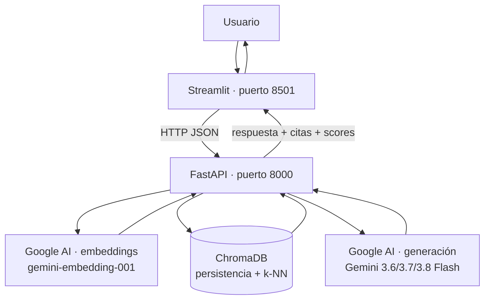

# Sistema RAG Bancario — Sistema de preguntas y respuestas sobre documentación bancaria BBVA.

Sistema **RAG** responde preguntas sobre un corpus de documentación bancaria
**anclando cada respuesta en la evidencia recuperada** y citando las fuentes.
Si la pregunta no tiene respuesta en el corpus, el sistema **se abstiene** en
lugar de inventar.

El ciclo completo es:

```
incrustar → indexar → recuperar top-k → generar respuesta anclada con citas
```

---

## Arquitectura

La interfaz **nunca** habla directamente con ChromaDB ni con Google AI: todo
pasa por la API de FastAPI. Streamlit es solo un cliente HTTP.



### Las cuatro piezas obligatorias

| Capa | Tecnología | Rol en el sistema |
|---|---|---|
| **UI** | Streamlit | Cargar documentos, preguntar y ver la respuesta con citas y scores |
| **API** | FastAPI | Ingestar, consultar e informar el estado del índice |
| **Índice** | ChromaDB | Guardar chunks + embeddings y devolver los más similares (persistente en disco) |
| **Embeddings + Generación** | Google AI (Gemini) | Convertir texto en vectores y redactar la respuesta anclada |

---

## Flujo de datos

El mismo modelo de embeddings se usa en los dos momentos (documentos y
preguntas); de lo contrario, la búsqueda de similitud no tendría sentido.

**Ingesta** (cuando se suben documentos):

```
archivo → (extracción de texto: decode o pypdf) → chunk.py → embed.py → store.py (Chroma)
```

**Consulta** (cuando el usuario pregunta):

```
pregunta → embed.py (pregunta → vector) → store.py (top-k más parecidos) → generate.py (Gemini redacta con citas) → respuesta
```

---

## Estructura de carpetas

```
rag-app/
├── README.md
├── requirements.txt
├── .env.example          # plantilla: GEMINI_API_KEY= (vacío, SÍ se sube)
├── .env                  # clave real (NO se sube, está en .gitignore)
├── .gitignore
├── data/                 # corpus (.md / .txt / .pdf)
├── chroma/               # persistencia de ChromaDB (en .gitignore)
├── app/
│   ├── __init__.py       # marca app/ como paquete de Python
│   ├── main.py           # FastAPI: /health, /ingest, /query
│   ├── chunk.py          # partición del texto en chunks con solape
│   ├── embed.py          # cliente de embeddings de Google AI
│   ├── store.py          # ChromaDB: alta y consulta top-k
│   └── generate.py       # Gemini: respuesta anclada + abstención + reintentos
└── ui/
    └── streamlit_app.py  # chat, carga de documentos, citas y scores
```
---

## Corpus

- **Dominio:** documentación operativa y de gobierno de un banco. Incluye, entre
  otros: modelo operativo, gobierno y estructura organizacional, captación y
  clientes, catálogo de servicios críticos y SLA, Command Center, y
  procedimientos de escalación y guardias, más una ficha institucional.
- **Tamaño:** 22 documentos, ~16,981 palabras, 92 chunks.
- **Formatos:** `.txt`, `.md` y `.pdf` (los PDF escaneados sin texto requieren
  OCR y no se indexan).
- Incluye al menos **una pregunta fuera de dominio** para probar la abstención
  (ej.: "¿Cuál es la tasa de interés de las tarjetas de crédito de Banorte?").

---

## Regla de abstención

El sistema se abstiene cuando la evidencia recuperada no cubre la pregunta,
en dos capas:

1. **Umbral sobre el mejor chunk (`MIN_SCORE = 0.3`):** si ni el chunk más
   parecido supera el umbral, el sistema se abstiene **sin llamar a Gemini**.
   Si el mejor pasa, se incluyen todos los `top-k` chunks en el contexto.
2. **Instrucción al modelo:** el prompt le indica a Gemini que, si el contexto
   no contiene la respuesta, lo diga en lugar de inventar.

> Nota: ChromaDB devuelve **distancias** (menor = más parecido). El `score`
> mostrado en la UI se deriva como `score = 1 - distancia`.

---

## Robustez

- **Reintentos con espera creciente** en la llamada a Gemini: los errores
  transitorios (503 / alta demanda) se reintentan automáticamente antes de
  reportar un fallo.
- **Timeouts** en el cliente HTTP de Streamlit (`/query` con margen amplio para
  cubrir los reintentos).
- Si un modelo está muy saturado, se puede **cambiar de modelo** desde la UI.

---

## Módulos

### `chunk.py` — partición del texto
Divide un texto largo en fragmentos ("chunks") de tamaño configurable con
**solape** (overlap) entre fragmentos vecinos, para no cortar ideas a la mitad.
- **Parámetros:** `chunk_size` (300 palabras), `overlap` (60 palabras).

### `embed.py` — embeddings con Google AI
Convierte un texto (chunk o pregunta) en un vector de **3072 dimensiones**.
Textos con significado parecido producen vectores cercanos (similitud del
coseno). Es la única fuente de embeddings del sistema.
- **Modelo:** `gemini-embedding-001`.

### `store.py` — índice vectorial (ChromaDB)
Guarda chunks + vectores + metadatos y, dada una pregunta ya vectorizada,
encuentra los `top-k` chunks más cercanos. Es **persistente en disco**
(carpeta `chroma/`): reiniciar la API no borra el índice. **No** se usa el
embedder por defecto de Chroma; se le pasan los vectores de Google AI.
- **Operaciones:** `add_chunks(...)` y `query_chunks(...)`.
- **Metadatos por chunk:** `source` (archivo) y `chunk_index` (posición).

### `generate.py` — respuesta anclada (Gemini)
Le pide a **Gemini** una respuesta redactada **solo con la evidencia**
recuperada, en español, citando `[1]`, `[2]`, … Incluye la regla de
**abstención** y **reintentos automáticos** ante errores transitorios de la API
(503 / sobrecarga): hasta 3 intentos con espera creciente (~2.5 s), envueltos
en `try/except` para que un fallo del modelo no tumbe la API.
- **Salida:** dict con `answer`, `abstained` y, si hubo fallo, `error`.
- **Modelo por defecto:** `gemini-3.6-flash` (configurable desde la UI).
  Umbral de abstención: `MIN_SCORE = 0.3`.

### `main.py` — la API (FastAPI)
Orquesta todo y lo expone como API HTTP. Único punto de entrada de Streamlit.

### `streamlit_app.py` — la interfaz (Streamlit)
Interfaz de **chat** que consume la API. Funciones:
- Subida de documentos **desde la barra de escritura** (`.txt`, `.md`, `.pdf`;
  el PDF se extrae con `pypdf`) que se indexan vía `/ingest`.
- Caja de chat que envía preguntas a `/query` y muestra respuesta, citas y
  scores, distinguiendo con color los estados (respuesta / abstención / error).
- **Selector de modelo** de Gemini (3.6 / 3.7 / 3.8 flash) y control de `top-k`.
- **Historial de chats** de la sesión (varias conversaciones conmutables).
- **Indicador de estado** de la API (llama a `/health`).
Nunca ejecuta lógica de RAG por su cuenta.

---

## Endpoints de la API

| Método | Ruta | Descripción |
|---|---|---|
| `GET` | `/health` | Confirma que la API vive |
| `POST` | `/ingest` | Recibe `text` y `source`, chunkifica, incrusta y persiste en Chroma. Devuelve nº de chunks indexados |
| `POST` | `/query` | Recibe `question`, opcional `top_k` y `model`. Devuelve `answer`, `citations` (id, source, text, score), `abstained` y `error` |

Documentación interactiva en `http://localhost:8000/docs` (Swagger).

### Estados de la respuesta de `/query`

| Estado | `abstained` | `error` | Significado |
|---|---|---|---|
| **Respondió** | `false` | `null` | Hubo evidencia y Gemini redactó la respuesta |
| **Se abstuvo** | `true` | `null` | Ningún chunk superó el umbral de similitud |
| **Error** | `false` | mensaje | Había evidencia, pero el modelo falló tras los reintentos |

---

## Instalación y ejecución

### 1. Requisitos previos
- Python 3.10+
- Clave de API de Google AI Studio: https://aistudio.google.com/apikey

### 2. Entorno e instalación
```bash
cd rag-app
python -m venv venv
source venv/bin/activate          # Windows: venv\Scripts\Activate.ps1
pip install -r requirements.txt
```

### 3. Configurar la clave
Copia `.env.example` a un archivo nuevo `.env` y pon tu clave real:
```
GEMINI_API_KEY=tu_clave_aqui
```
> `.env` está en `.gitignore` y **no** se sube. `.env.example` es la plantilla.

### 4. Levantar la API y la UI (dos terminales)
```bash
# Terminal 1 — API
uvicorn app.main:app --reload --port 8000

# Terminal 2 — UI
streamlit run ui/streamlit_app.py
```

Abre Streamlit (normalmente `http://localhost:8501`), adjunta documentos desde
la barra de escritura para indexarlos, y haz tu primera pregunta.

---


