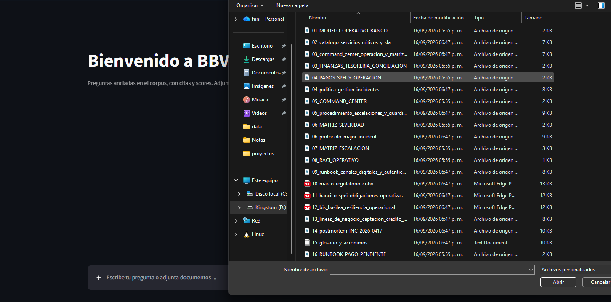
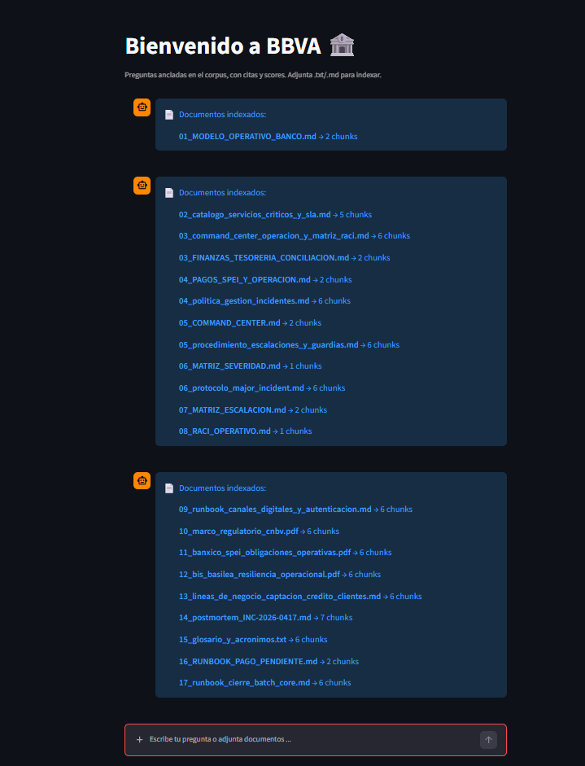
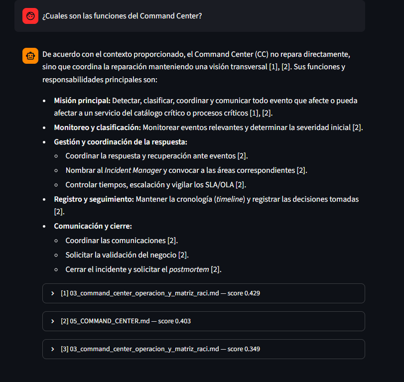
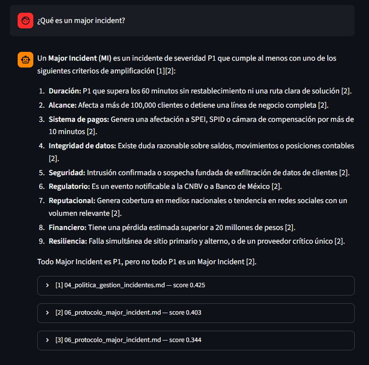
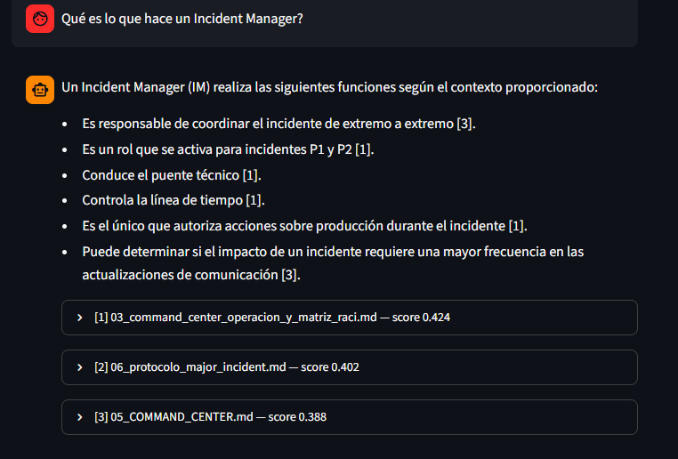
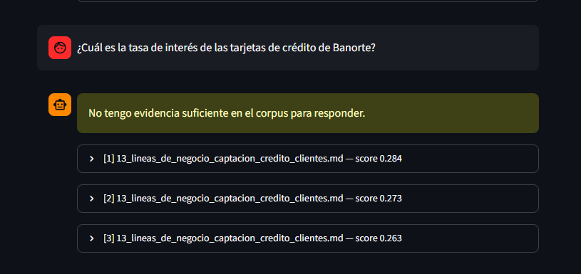
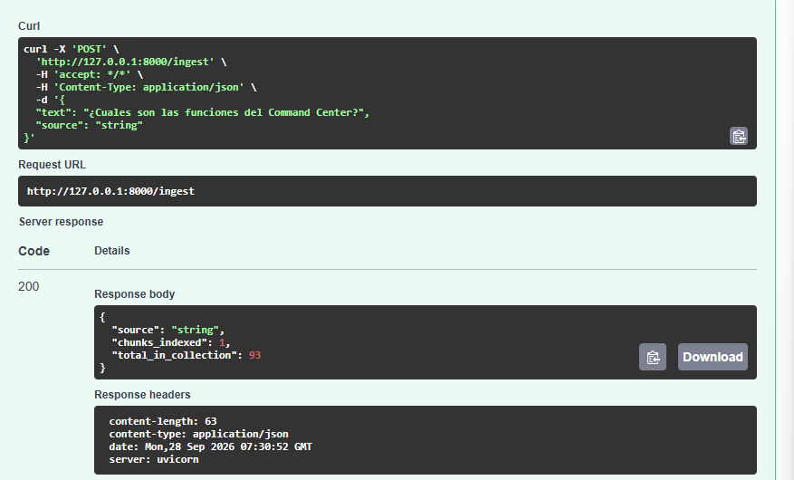
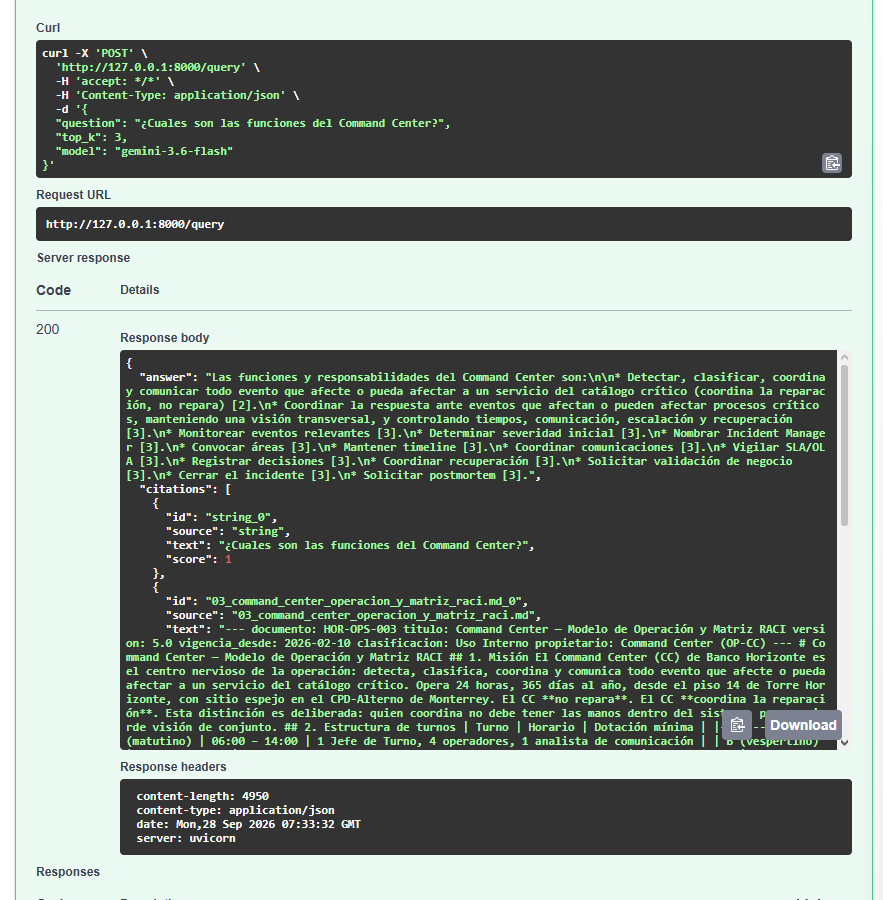

# Proyecto  — Sistema RAG (Streamlit + FastAPI + ChromaDB + Google AI)

**Materia:** Introducción a la Inteligencia Artificial
**Unidad / Módulo:** Proyecto final
**Actividad:** Proyecto
**Estudiante:** Christian Isaac Dzul Canul
**Programa:** Maestría en Inteligencia Artificial 🎓
**Docente:** Dr. Víctor Uc Cetina
**Fecha:** `04/10/2026`
**Autor:** Christian · 
**Stack:** Streamlit · FastAPI · ChromaDB · Google AI (Gemini)

---

## 1. Dominio y tamaño del corpus

El corpus cubre **documentación operativa y de gobierno de un sistema
bancario**: modelo operativo, gobierno y estructura organizacional, captación y
clientes, catálogo de servicios críticos y SLA, Command Center, finanzas y
tesorería, gestión de incidentes (severidad, escalación, guardias, major
incident, postmortem), runbooks operativos y marco regulatorio (CNBV, Banxico,
BIS), más un glosario.

- **Documentos:** 22 archivos (`.md`, `.pdf` y `.txt`).
- **Tamaño total:** ~16,981 palabras.
- **Chunks indexados:** 92 (confirmado con `collection.count()`).
- **Modelo de embedding:** `gemini-embedding-001` (Google AI), vectores de
  **3072 dimensiones**.

El índice se guarda de forma **persistente** en disco (ChromaDB, carpeta
`chroma/`): reiniciar la API no reconstruye el índice, lo cual se verificó
comprobando que `collection.count()` se mantiene estable entre reinicios.

## 2. Partición en chunks (tamaño y overlap)

Cada documento se divide en fragmentos de **300 palabras** con un **solape de
60 palabras** (`chunk.py`). Así, cada chunk nuevo avanza 240 palabras y comparte
60 con el anterior.

- **Por qué 300 palabras:** un tamaño intermedio dentro del rango sugerido
  (200–400). Suficiente contexto para que un fragmento sea auto-contenido, sin
  ser tan grande que diluya la relevancia (un chunk enorme mezclaría varios
  temas y bajaría la precisión de la recuperación).
- **Por qué 60 de solape:** evita cortar una idea justo en el límite entre dos
  chunks. Si una frase relevante queda partida, el solape garantiza que aparezca
  completa en al menos uno de los dos fragmentos.

## 3. La Abstención

La abstención usa un **umbral de similitud mínimo `MIN_SCORE = 0.3`** aplicado
sobre el **mejor** chunk recuperado, en dos capas:

1. **Compuerta por umbral:** si ni el chunk más parecido supera 0.3, el sistema
   se abstiene **sin llamar a Gemini** (respuesta determinista y ahorro de
   cuota). Si el mejor chunk pasa, se incluyen todos los `top-k` en el contexto
   y se delega en el modelo la decisión de cuáles citar.
2. **Instrucción al modelo:** el prompt indica a Gemini que responda *solo* con
   el contexto y que, si este no cubre la pregunta, diga explícitamente
   "No tengo evidencia suficiente en el corpus para responder".

El umbral se calibró empíricamente: una pregunta del dominio obtuvo score ≈ 0.52
y una fuera de dominio (por ejemplo: "¿Como es el proceso de incidentes en Bancomer?") ≈ −0.03, una brecha amplia que hace
que 0.3 separe limpiamente ambos casos. (Nota: el score es `1 − distancia` de
ChromaDB, por lo que puede ser negativo cuando dos vectores son muy distintos.)

## 4. Google AI y ChromaDB

**Google AI (Gemini) cumple dos roles distintos, con dos modelos distintos:**

- **Embeddings** (`gemini-embedding-001`): convierte cada chunk y cada pregunta
  en un vector numérico. El **mismo** modelo se usa para documentos y preguntas,
  requisito para que la comparación por similitud tenga sentido.
- **Generación** (`gemini-3.6-flash`): redacta la respuesta final en español,
  anclada en los chunks recuperados y con citas `[n]`. No se concatenan chunks a
  mano: el modelo sintetiza una respuesta legible a partir de la evidencia.

**ChromaDB** es la base vectorial persistente. Almacena cada chunk junto con su
vector (calculado por Google AI, no por el embedder por defecto de Chroma) y sus
metadatos (`source`, `chunk_index`). Dada la pregunta ya vectorizada, ejecuta la
búsqueda **k-NN** y devuelve los `top-k` chunks más cercanos con su distancia,
que la API convierte en score.

En resumen: **Google AI entiende y redacta; ChromaDB almacena y busca.

## Robustez

Durante las pruebas, se pudo observar que el modelo de Gemini puede devolver errores transitorios (503 / alta
demanda) los cuales eran muy comunes. Para mejorar esto, la llamada al modelo **reintenta automáticamente**
(3 intentos con espera creciente de 2.5 s) antes de reportar un fallo, todo
protegido con `try/except` para que la API nunca devuelva un error 500. La UI permite
además **cambiar de modelo** (Gemini 3.6 / 3.7 / 3.8 flash) si uno está
saturado. Los documentos se aceptan en `.txt`, `.md` y `.pdf` (estos últimos
se extraen con `pypdf`, es importante considerar que un PDF escaneado sin texto requeriría OCR, lo cual no esta implementado en esta primera etapa del proyecto).

## Evidencias en prueba:

>Carga e indexamiento del corpus:

>Streamlit (preguntas dentro del dominio con citas y scores)

- Pregunta 1: ¿Cuales son las funciones del Command Center?

- Pregunta 2: ¿Qué es un major incident?

- Pregunta 3: ¿Qué es lo que hace un Incident Manager?

>Streamlit (preguntas fuera del dominio con citas y scores)

- Pregunta fuera del dominio (abstained): ¿Cuál es la tasa de interés de las tarjetas de crédito de Banorte?

> Preguntas en /docs contra FastAPI

- POST /ingest:

- POST /query:

