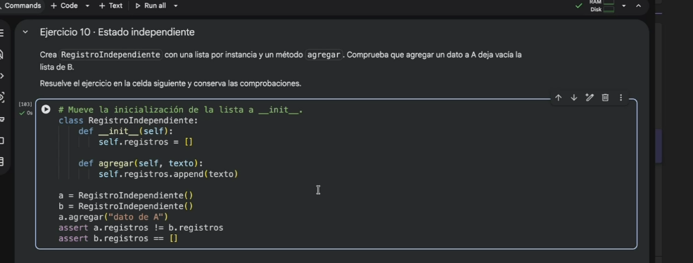
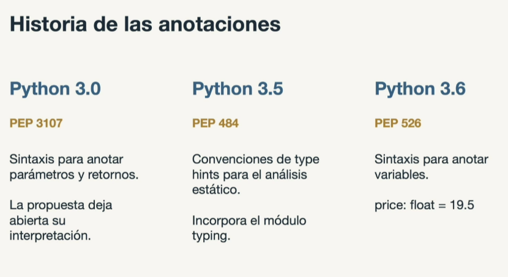
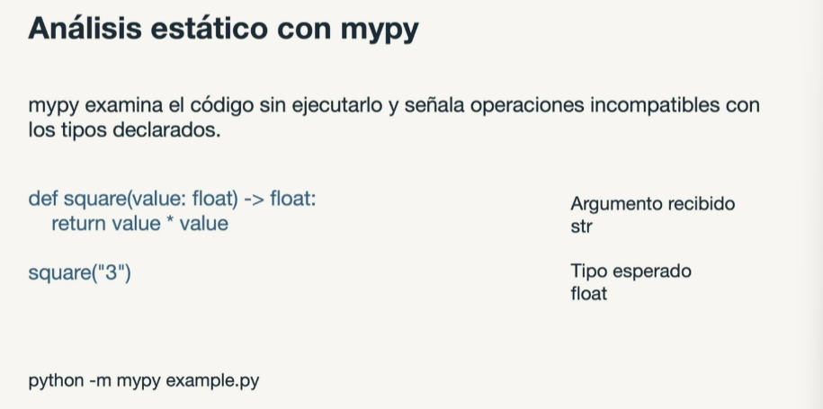

# 🎓 Maestria en Inteligencia Artificial

#### Fecha: `[21/09/2026]`

#### 📌 Notas y Hallazgos (Día 01):

> _Notas de clase:_

#### Introduccion

Programar es la representacion de una tarea expresada con reglas.

Herramientas e instrumentos a utiizar durante la materia:

- Python

Bibliotecas: Numpy, pythorch, pandas, matplotlib, etc.

Python Enhancement proposal (PEP): documenta una propuesta

tooling para analisis estatico (mypy):

pydanic: biblioteca de validacion de datos bados en anotaciones de tipo y manejo de errores