# 🎓 Maestria en Inteligencia Artificial

#### Fecha: `[27/08/2002]`

#### 📌 Notas y Hallazgos (Día 02):

> _Notas de clase:_

#### _Agents and environments_

Agents include humans, robots, softbots, thermostats, etc.
The agent executes actions and then perceives it.

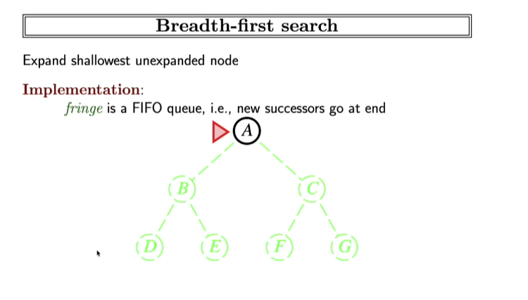

The agent function maps from percept histories to actions:

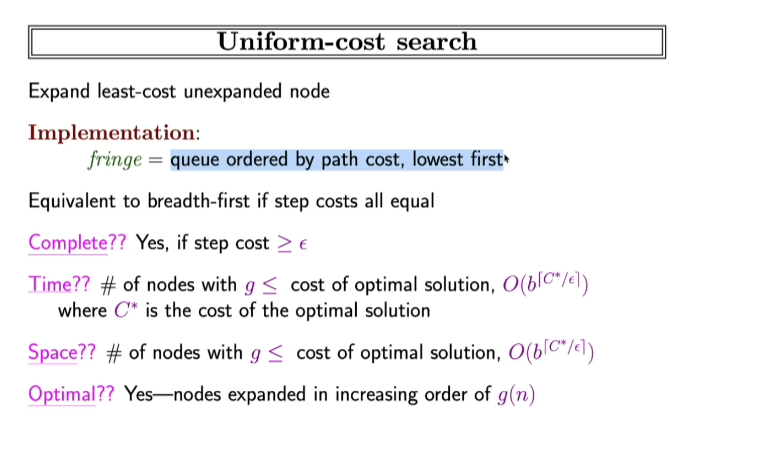

The agent program runs on the physical architecture to produce "f".

- Example of Vacuum-cleaner:

Percepts: location and contents (pos A, state: Dirty)
Actions: move to the left, right, Suck, NoOperation.

- Posibilities:

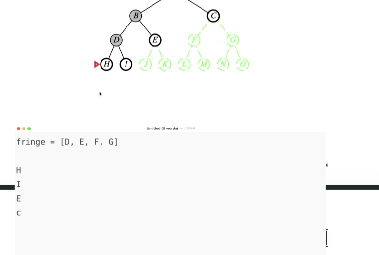

- Rationality:

A system/agent is rational when:

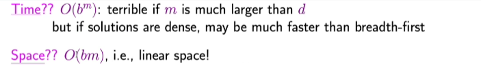

- Peas

To desing a rational agent, we must specify the task environment. Consider, eg, the task of designing an automated taxi:

- Performance measure
- Environment: Objetos con los que interactuara.
- Actuators: Aquello que te permite ejecutar las acciones en tu ambiente.
- Sensors: Como el agente percibira el ambiente, que esta pasando en el.

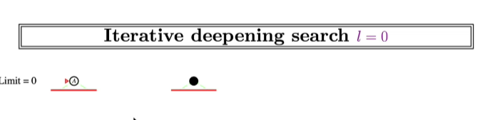

Otro ejemplo:
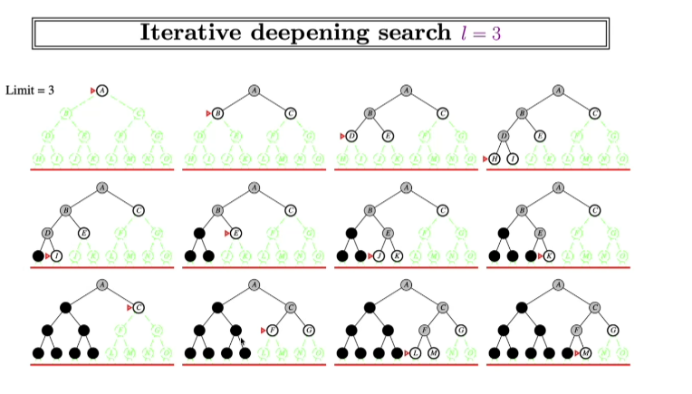

En cuanto el ambiente, hay que considerar las siguientes caracteristicas o tipos:

Sea observable: Tal cual se pueda observar con detalle.
Deterministico: Que ya se sabe que ocurrira con cierta accion, no tiene aletoriedad. no son estocastivo.
Episodico: Sistemas donde puede funcionar en diferentes acciones, que sea versatil, que no sea secuencial.
Estatico: Es que no hay variabilidad en el ambiente donde se esta desarrollando.
Discreto: conjunto finito de estados y acciones/numeros
Single-agent: el uso de un solo agente (no multiagente)

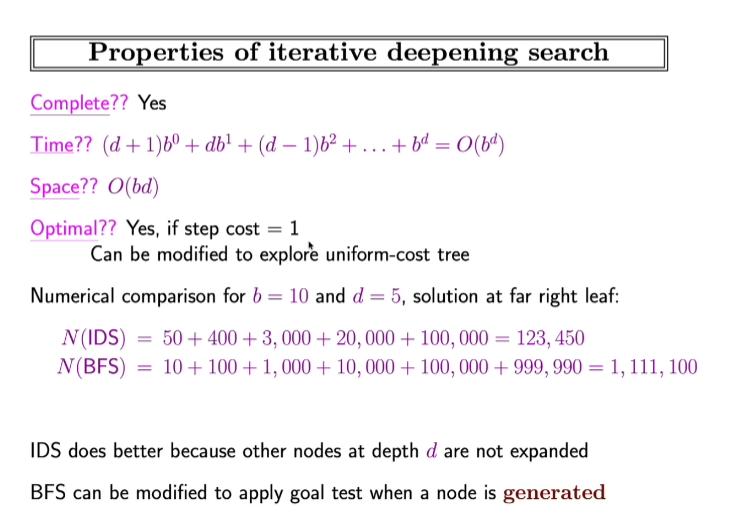

#### _Agemt types_

There are many, but the basic types are:

- Simple reflex agents:

No tiene memoria, puede ser mas para consultas.

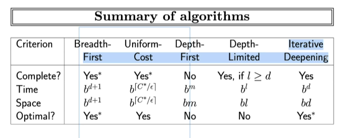

- Reflex agents with state:

Lleva registro de lo que va persibiendo, guardndo contexto y memoria.

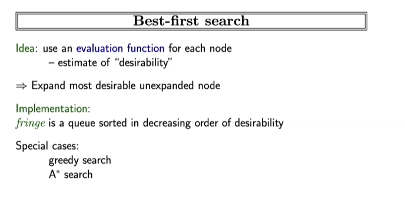

- Goal-based agents:

Contiene todo lo anterior, pero adicionalmente, puede saber que es una meta. Ademas de llevar registro, este mismo se puede establecer metas que maximisen su desempeño.

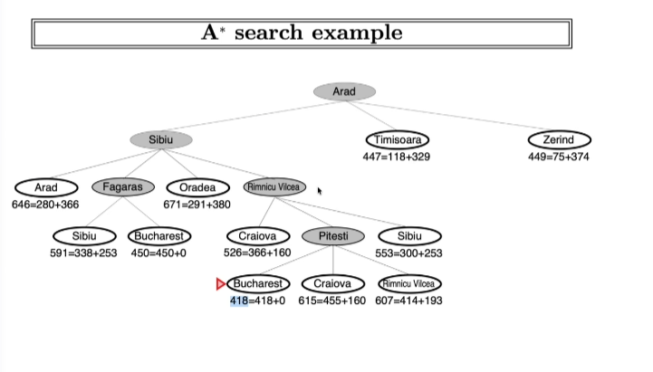

- Utility-based agents

Este optimiza seleccionando la opcion que mejor le conviene tanto en tiempo, como en performance, ajustado a la necesidad.

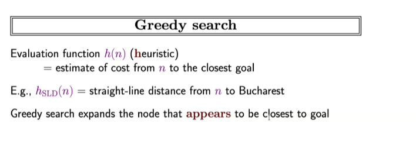

- Learning agents

Aquellos que tienen una arquitectura que aprende por refuerzo y recompensas. Que le permite a identificar cuando hacer o no una accion o respuesta dado a los refuerzos con los que ha aprendido. Reinforcement learning. Es el modelo de agente mas moderno y utilizada.

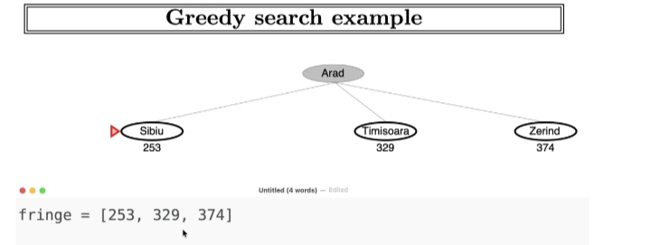

#### _Rational agents_

An agents is an entity that perceives and acts. This clase is about designing rational agents.

> _Notas generales:_

- Las grabaciones se guardaran en teams oficial de la UADY.
- La proxima semana ya nos daran nuestras credenciales para el correo constitucional.
- Las tareas se guardan con la nomenglatura:
  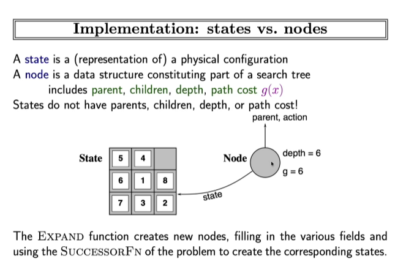
- Contestar el formulario para compartir mi URL/Profile de github.
- Para las tareas de esta semana sera el 04 de septiembre del 2026:
  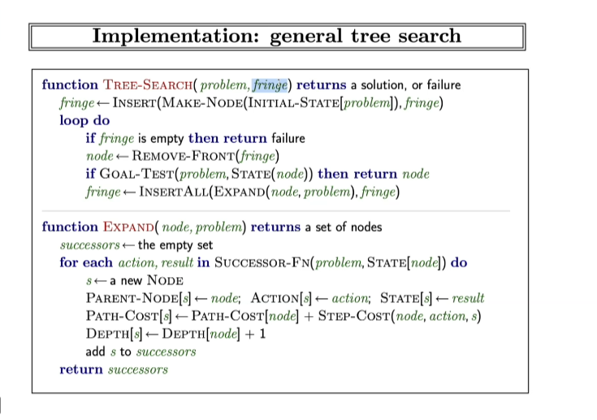
- AlumnoFMAT9 (para acceso en computadora)
- Alan Turing "Father of AI"
- Agentes >> ejercicios >> ejercicio 01 >> El mundo de wumpus

clonar lo de wumpus, ejecutar cada programa de wumpus, leer el README.md para la creacion del entorno e instalar paqueterias necesarias y asi poder ejecutar los scripts de Python.

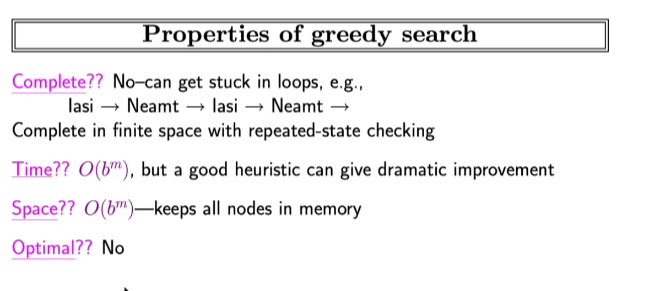

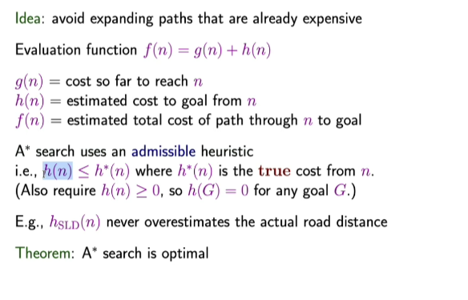

---

#### Fecha: `[28/08/2026]`

#### 📌 Notas y Hallazgos (Día 03):

#### Metodos de busqueda

- Tree search

Va buscando branch por branch, estado, o nodo hasta llegar al objetivo.
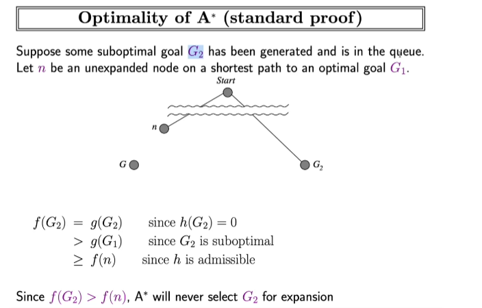

> _Notas generales:_

- reubicar wumpus, agujeros, etc. El tamanio del agente. Y modificar esto en el yaml, posteriormente correrlo los agentes

---

> ### Fecha: `[31/08/2026]`

####  📌 Notas y Hallazgos (Día 04):

### Problem Solving & search

- Formulate a goal: e.g: Be in Bucharest.
- Formulate problem: 
  - states: various cities
  - actions: drive between cities
- Find solution: Sequence of cities, e.g., Arad, Sibiu, Fagaras, then Bucharest.

Tip:

  - Identificar si es realmente un problema de busqueda lo que realmente se necesita.
  - Abstraer el problema para definir los componentes de este (estados, acciones, como almacenar los estados en el programa, etc).
  - Funcion sucesor:para cada estado, hay puntos de acciones a ejecutar, le correspondera a un estado siguiente (transita de un estado a otro).

Implementation: States vs Nodes

Implementation: general tree search

> _Notas generales:_

---

> ### Fecha: `[01/09/2026]`

####  📌 Notas y Hallazgos (Día 05):

### Problem Solving & search

Expand function: It creates new nodes, filling in the various fields and using the SUCCESSORFN of the problem to create corresponding states.

> Breadth-first search 

-  Expand shallowest unexpanded node

-Implementation:

> FIFO vs LIFO

- Firs in, first out, and the other is last in, first out in the queue.

> Uniform-cost Search

- Expand least-cost unexpanded node

- Implementation:

> Depth-first Search

- Expand deepest unexpanded node:

- Implementation:

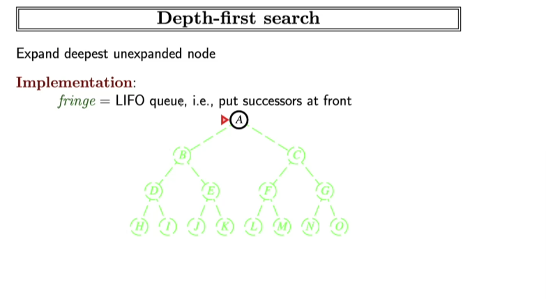

- Ejemplo del uso de LIFO (simepre se van por una rama para ir analizando):

- Properties of depth-first search: 
  - Is not complete: Fails in infinite-depth spaces, spaces with loops. Modify to avoid repeated states along path --> Complete in finite spaces

  

  - Not optimal

> Iterative deepening search l = 0, you can use a hybrid of algorithms to avoid making a lot of interaction or limiting the limit like in this example (busqueda forzada a lo ancho):

- Properties:

> Summary of algorithms

Hay otro algoritmo que es el bidirectional, basicamente empezar dos busquedas en paralelo, por ejemplo de A a Z, y de Z a A.  --> Objetive <---

> Best-first search:

- Use an evaluation function for each node, estimate of "desirability", expand most desirable unexpanded node:

- Implementation:

> Heuristics: Aproximacion o estimacion de un valor/ruta/objetivo.

_Notas generales:_

- Para los algoritmos se requiere considerar el costo y necesidades de lo que se quiere alcanzar, ya que algunos pueden no ser tan optimos para ciertas casisticas, o bien, pueden consumir mucha memoria, siendo contraproducente su uso.

> Greedy search
- Evalua la h(n) -- heuristic, escogiendo el nodo que mas te acercara a la meta u pbjetivo tomando en consideracion la heuristica.
- Implementation:

- Ejemplo usando fifo ordenada o cola de prioridad:

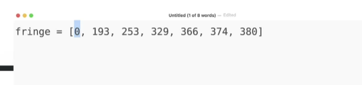

se van insertando, pero se ordenan de menor a mayor para encontrar el menor valor de heuristica para encontrar la mejor solucion.

- Properties:

> A * Search:

- La heuristica de la meta siempre es 0 for any G.
- Este algoritmo te garantiza a encontrar la mejor solucion, se debe seleccionar esa h para garantizar que se encuentre la mejor solucion.
- Se van asignando valores para ir evaluando los costos y evitar entrar en loops, y de tomar las mas costosas, evaluando solo lo necesario.

Example:

Optimal of A* (standard proof):

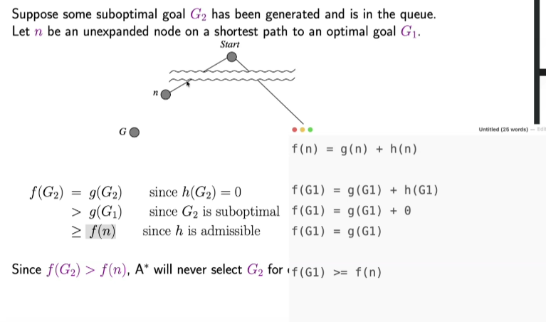

> Proof of lemma: Consistency

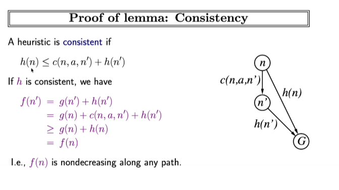

- Admisible heuristics: 

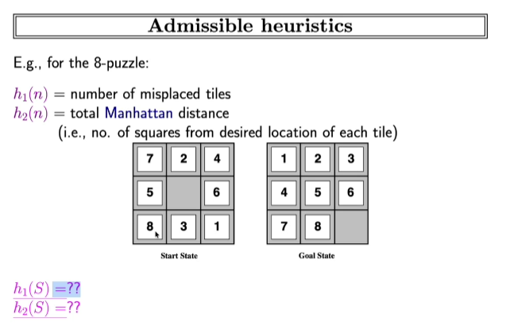

- dominance

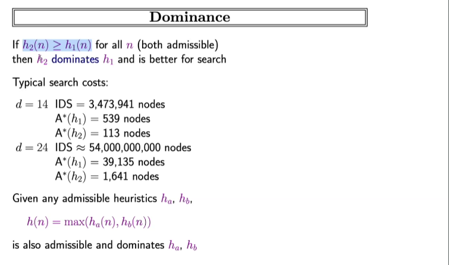

- relaxed problems:

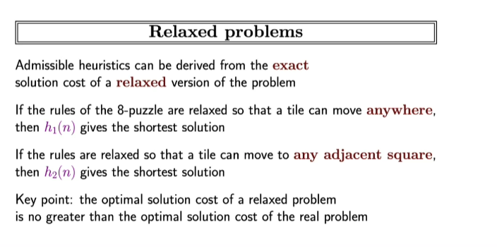

---

> ### Fecha: `[03/09/2026]`

####  📌 Notas y Hallazgos (Día 06):

### Problem Solving & search

Aprendizaje supervisado.

Aprendizaje no supervisado.

## Metodos:

- Regresion linear:

Un agente o modelo debe ser capaz de generalizar, esto con el fin de poder hacer predcciones mas acertadas en diferentes circunstancias. Para ello es muy importante la informacion y datos que se utilicen para entrenar al modelo.

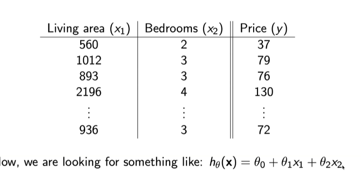

Cada termino parametro, se representa como un nuevo termino, asi como se observa en la imagen con cada 0 (theta), teniendo asi hasta 3 pesos al momento de predecir el valor. Para cada termino que no sea de mucho valor o no tenga mucha correlacion con la variable que nos importe que nos pueda apoyar a predecirlo, este le asignara un peso mucho menor, asignandole valores cercanas a 0.

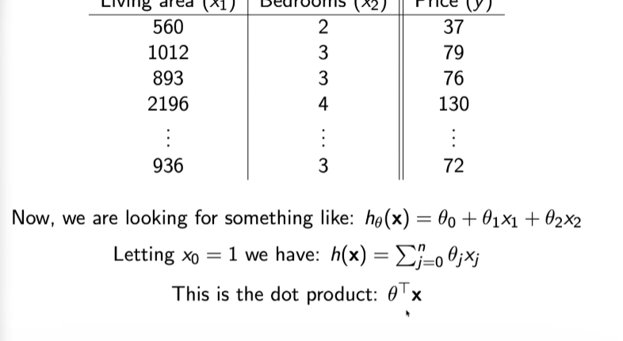

No tiene ordenada al cero, todas las neuronas deben tener terminos independientes de la varuable de entrada. Ya que no importa que valor se le ponga al parametro, este debe ser independiente de la viariable.

A mayor terminos, mayor flexibilidad puede tener el modelo.

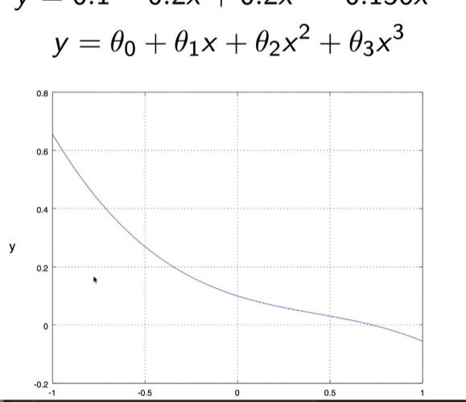

Funciones de error para metir y comparar el desempeño de los modelos, siendo la funcion de costo como:

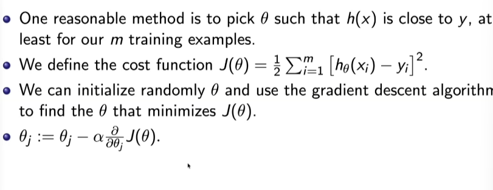

Estimando parametros:

- Para este ejemplo se uso un polinomio y se utilizaron valores random para los intervalos para inicializarlo

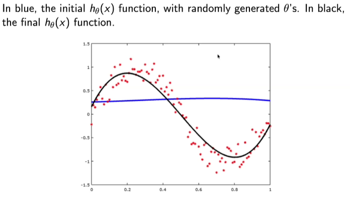

Se usa J para evaluar el error que se obtuvo sumando los puntos reales en contra a la prediccion y que tan lejos estuvo de este.

  - Update rule:

  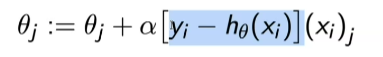

Es recomentable usar un batch gradient descent que evalue y actualice por ejemplo mas que actualizarlo por todos los ejemplos o J

   
- Neuronas:

Es un modelo lineal 
