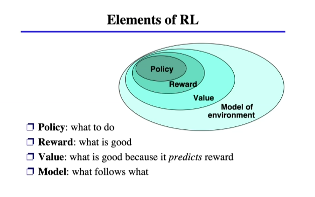

> ### Fecha: `[07/09/2026]`

####  📌 Notas y Hallazgos (Día 08):

### Clustering K-medias

El **Clustering de K-medias (K-means)** es una de las técnicas más populares del **aprendizaje no supervisado**, la cual se utiliza para encontrar estructuras o patrones ocultos en datos que no están etiquetados [1-3]. Su objetivo principal es dividir un conjunto de datos en **grupos naturales llamados "clusters"**, de tal manera que los elementos dentro de un mismo grupo sean muy similares entre sí y muy diferentes a los de otros grupos [2, 3].

A continuación, se explica su funcionamiento de manera completa y sencilla:

### 1. ¿Qué es el "K" y qué son las "Medias"?
*   **La "K":** Representa el número de grupos o clusters que deseas crear [4, 5]. Es un número entero positivo que el usuario debe definir antes de iniciar el algoritmo [6, 7].
*   **Las "Medias" (Centroides):** Son el "corazón" del algoritmo [4, 8]. Cada grupo tiene un punto central llamado **centroide**, que representa el promedio (la media) de todos los puntos asignados a ese grupo [8-10].

### 2. ¿Cómo funciona el algoritmo? (Paso a paso)
El proceso es iterativo, lo que significa que el algoritmo repite los mismos pasos varias veces hasta que los grupos se estabilizan [4, 8, 11]:

1.  **Elección de K:** Se decide cuántos grupos se quieren formar [6].
2.  **Selección inicial:** Se eligen *k* puntos al azar como los centroides iniciales [6, 12].
3.  **Asignación de puntos:** Se calcula la **distancia** (generalmente la distancia Euclidiana) entre cada dato y cada centroide [4, 6, 12]. Cada dato se asigna al cluster cuyo centroide esté más cerca [6, 11].
4.  **Actualización de centroides:** Una vez que todos los datos tienen un grupo, se calcula una nueva posición para cada centroide promediando la ubicación de todos los puntos asignados a él [9-11].
5.  **Repetición:** Los pasos 3 y 4 se repiten una y otra vez hasta que **convergen**; es decir, hasta que ningún dato cambie de grupo de una repetición a otra [9-11, 13].

### 3. ¿Cómo elegir el número correcto de grupos (K)?
Dado que el usuario debe proporcionar el valor de *k*, una técnica común para encontrar el número óptimo es el **Método del Codo (Elbow Method)** [14]. Consiste en graficar el número de clusters frente a la varianza de los datos; el punto donde la curva se dobla bruscamente (como un codo) sugiere la cantidad ideal de grupos para ese conjunto de datos [14].

### 4. Ventajas y Limitaciones
*   **Ventajas:** Es un algoritmo sencillo de entender, rápido de procesar y muy efectivo para grandes volúmenes de datos [4, 15].
*   **Limitaciones:** 
    *   Requiere que el usuario defina *k* de antemano, lo cual puede ser difícil si no conoces bien los datos [7].
    *   Es sensible a los **valores atípicos (outliers)**, que pueden deformar los promedios [16].
    *   Tiende a crear clusters de forma circular; si los datos tienen formas alargadas o elípticas, el algoritmo puede tener dificultades para agruparlos correctamente en comparación con otros métodos como GMM (Modelos de Mezcla Gaussiana) [17].

**Ejemplo práctico:** Imagina que tienes una mezcla de imágenes de perros y gatos sin etiquetas [2, 18]. El algoritmo de K-medias analizará características como la forma de las orejas o el tamaño, y separará las fotos en dos grupos basados en sus similitudes visuales, incluso sin saber qué es un "perro" o un "gato" [2, 18].

¿Te gustaría que generemos una **infografía** o una **guía de estudio** que resuma visualmente este proceso y lo compare con otros tipos de clustering?

> ### Fecha: `[10/09/2026]`

####  📌 Notas y Hallazgos (Día 10):

> `Reinforcement learning`

Elementos:

El **Aprendizaje por Refuerzo (Reinforcement Learning - RL)** es uno de los tres paradigmas fundamentales del Machine Learning, junto con el aprendizaje supervisado y el no supervisado. Consiste en un enfoque basado en retroalimentación (*feedback-based*) en el cual un agente software o máquina interactúa de forma autónoma con un entorno desconocido y aprende a tomar decisiones mediante su propia experiencia.

A diferencia del aprendizaje supervisado, el aprendizaje por refuerzo no requiere pares de entrada/salida etiquetados ni exige que un tutor corrija explícitamente las acciones subóptimas. En su lugar, el agente aprende por ensayo y error (*hit and trial*). Al ejecutar una acción, el entorno le otorga una **recompensa** (positiva) si la decisión fue adecuada o una **penalización/castigo** (negativa) si cometió un error. El objetivo del agente es maximizar la suma acumulada de recompensas a lo largo del tiempo.

---

### 1. Características Principales

* **Aprendizaje Autónomo por Experiencia**: La máquina aprende sin datos etiquetados previos, ajustando sus decisiones mediante las señales de recompensa y castigo devueltas por el entorno.
* **Compromiso entre Exploración y Explotación (*Exploration vs. Exploitation*)**: El agente debe equilibrar la *explotación* (elegir las acciones conocidas que maximizan la recompensa inmediata) y la *exploración* (probar estados y acciones no explorados para obtener nueva información que mejore las decisiones futuras).
* **Decisiones Secuenciales y Recompensas Retardadas**: Las acciones del agente no solo producen un resultado inmediato, sino que condicionan los estados futuros y las recompensas subsiguientes. En muchos entornos, las recompensas son muy escasas (*sparse rewards*), otorgándose únicamente al final de una larga secuencia de pasos (como ganar o perder una partida de ajedrez).
* **Problema de Asignación de Crédito (*Credit Assignment Problem*)**: Debido a que la recompensa puede recibirse mucho tiempo después de iniciar la secuencia de acciones, el agente debe determinar qué decisiones específicas fueron las responsables del éxito o fracaso.
* **Formalización mediante MDP**: Los problemas de aprendizaje por refuerzo se estructuran formalmente bajo el marco de los Procesos de Decisión de Markov (MDP).

---

### 2. Elementos Fundamentales del Aprendizaje por Refuerzo

El ciclo de interacción en el aprendizaje por refuerzo involucra los siguientes componentes clave:

1. **Agente (*Agent*)**: Es la entidad tomadora de decisiones o el sistema que aprende a actuar dentro del entorno.
2. **Entorno (*Environment*)**: Es el mundo exterior o contexto con el que interactúa el agente y sobre el cual este no tiene control directo.
3. **Estado (*State - \\(S\\)*)**: Representa la situación, configuración o posición actual del entorno observada por el agente en un instante dado.
4. **Acción (*Action - \\(A\\)*)**: Es el conjunto de decisiones o movimientos posibles que el agente puede ejecutar estando en un estado determinado.
5. **Recompensa / Castigo (*Reward / Penalty - \\(R\\)*)**: Es una señal numérica devuelta por el entorno tras cada acción. Mide la utilidad o conveniencia inmediata de haber alcanzado el nuevo estado.
6. **Política (*Policy - \\(\pi\\)*)**: Es la regla o función de mapeo que le indica al agente qué acción elegir según el estado en el que se encuentra. La política óptima (\\(\pi^*\\)) es aquella que maximiza la recompensa futura esperada.
7. **Función de Valor / Utilidad (*Value / Utility / Q-Function*)**:
   * **Función de Valor de Estado \\(U(s)\\) o \\(V(s)\\)**: Estima la suma esperada de recompensas futuras descontadas a partir de un estado \\(s\\).
   * **Función de Valor de Acción \\(Q(s,a)\\) (Calidad / *Q-Function*)**: Mide la recompensa futura esperada al tomar la acción \\(a\\) en el estado \\(s\\) y continuar actuando óptimamente desde allí.
8. **Factor de Descuento (\\(\gamma\\))**: Parámetro entre 0 y 1 que determina la relevancia de las recompensas futuras en comparación con las inmediatas; un valor cercano a 0 prioriza el beneficio a corto plazo, mientras que un valor cercano a 1 le da mayor peso a los beneficios a largo plazo.

---

### 3. Formulación Matemática: MDP y Ecuaciones de Bellman

Un **Proceso de Decisión de Markov (MDP)** se compone de un conjunto de estados (\\(S\\)), acciones (\\(A\\)), modelo de transición de probabilidades (\\(P(s'|s,a)\\)), función de recompensa (\\(R(s,a,s')\\)) y factor de descuento (\\(\gamma\\)).

Para resolver un MDP y hallar la política óptima, se emplean las **Ecuaciones de Bellman**. Estas ecuaciones descomponen recursivamente el valor de un estado (o par estado-acción) en la recompensa inmediata recibida más el valor descontado del estado sucesor:

\\[ U(s) = \max_{a \in A(s)} \sum_{s'} P(s'|s,a) \left[ R(s,a,s') + \gamma U(s') \right] \\]

\\[ Q(s,a) = \sum_{s'} P(s'|s,a) \left[ R(s,a,s') + \gamma \max_{a'} Q(s',a') \right] \\]

---

### 4. Clasificación de Enfoques y Algoritmos

Las técnicas de aprendizaje por refuerzo se categorizan según el modo en que representan y aprenden la información del entorno:

#### A. Según el Uso de un Modelo del Entorno
* **Basado en Modelo (*Model-Based*)**: El agente aprende o utiliza un modelo explicito de las transiciones del entorno (\\(P(s'|s,a)\\)) para simular, planificar o predecir los efectos de sus acciones antes de ejecutarlas.
* **Libre de Modelo (*Model-Free*)**: El agente no intenta aprender un modelo explícito del entorno; en su lugar, aprende directamente a comportarse ajustando valores de acción o políticas mediante su experiencia.

#### B. Según la Política de Aprendizaje
* **On-Policy**: El agente evalúa y mejora exactamente la misma política que está utilizando para explorar y tomar decisiones en ese momento.
  * *Ejemplo*: **SARSA** (*State-Action-Reward-State-Action*), que actualiza los valores \\(Q\\) considerando la acción real (\\(A'\\)) ejecutada por la política actual en el estado siguiente (\\(S'\\)).
* **Off-Policy**: El agente aprende el valor de la política óptima independientemente de las acciones de exploración o decisiones aleatorias que tome mientras recopila experiencia.
  * *Ejemplo*: **Q-Learning**, que actualiza la tabla de valores \\(Q\\) utilizando la máxima recompensa futura posible del siguiente estado, sin importar la acción concreta que se elija durante la exploración.

#### C. Algoritmos Destacados
* **Diferencia Temporal (Temporal-Difference / TD)**: Modifica las estimaciones de utilidad guiándose por la diferencia entre estados consecutivos en tiempo real, sin esperar a que concluya el episodio completo.
* **Métodos Monte Carlo**: Calculan las estimaciones de valor promediando los retornos acumulados al final de episodios completos de entrenamiento.
* **Búsqueda de Políticas (*Policy Search*)**: Optimiza directamente los parámetros de una representación de política \\(\pi_\theta(s,a)\\) mediante gradientes (por ejemplo, el algoritmo REINFORCE).

---

### 5. Aprendizaje por Refuerzo Profundo (Deep RL)

En entornos complejos con espacios de estados continuos o de alta dimensión (como imágenes de video o sensores robóticos), no es posible almacenar valores en tablas (*Q-Tables*). 

El **Aprendizaje por Refuerzo Profundo (*Deep Reinforcement Learning*)** utiliza redes neuronales profundas como aproximadores no lineales de funciones de valor o políticas. Esto le permite al agente generalizar a partir de estados conocidos hacia estados nunca antes vistos. Entre sus aplicaciones más representativas destacan **DQN** (Deep Q-Network), capaz de jugar títulos de Atari a nivel experto a partir de los píxeles de la pantalla, y **AlphaGo / AlphaZero**, que superó a campeones mundiales de Go combinando Deep RL con búsqueda en árbol de Monte Carlo.

---

🎮 **¿Te gustaría que profundicemos en el funcionamiento del algoritmo Q-Learning con un ejemplo paso a paso de su tabla Q, o prefieres explorar sus aplicaciones en robótica?**

El algoritmo **Q-Learning** es un método de aprendizaje por refuerzo **libre de modelo (*model-free*)** y **fuera de política (*off-policy*)**. Su objetivo principal es aprender una política óptima que maximice la recompensa total acumulada sin necesidad de conocer previamente las probabilidades de transición ni la dinámica explícita del entorno.

En este contexto, la letra **'Q'** representa la palabra **Calidad (*Quality*)**, la cual mide la utilidad o recompensa futura esperada al ejecutar una acción específica en un estado determinado.

---

### 1. La Estructura de Datos: La Tabla Q (*Q-Table*)

Para entornos con espacios de estados y acciones pequeños o discretos, el algoritmo almacena las estimaciones de utilidad en una estructura de datos llamada **Q-Table**:

* **Matriz de Estado-Acción**: La Q-Table es una tabla de consulta donde las **filas representan los estados (\\(s\\))** y las **columnas representan las acciones (\\(a\\))**.
* **Inicialización**: Inicialmente, todos los valores de la tabla se inicializan en cero (u otro valor predeterminado).
* **Tabla de Referencia**: A medida que el agente interactúa con el entorno, la tabla actualiza sus celdas para aproximar los valores reales de \\(Q(s, a)\\). Una vez entrenada, sirve de guía para que el agente elija la mejor acción seleccionando \\(\arg\max_a Q(s,a)\\) en cada estado.

---

### 2. Regla de Actualización y Ecuación de Bellman

El núcleo de Q-Learning se basa en la **Ecuación de Bellman** aplicada a funciones de valor de acción. Cada vez que el agente ejecuta una acción \\(a\\) en un estado \\(s\\), recibe una recompensa \\(R(s,a,s')\\) y transita a un nuevo estado \\(s'\\).

La regla de actualización por **Diferencia Temporal (TD)** modifica el valor \\(Q(s, a)\\) usando la siguiente fórmula:

\\[ Q(s, a) \leftarrow Q(s, a) + \alpha \left[ R(s,a,s') + \gamma \max_{a'} Q(s', a') - Q(s, a) \right] \\]

Donde cada componente representa lo siguiente:
* **\\(Q(s, a)\\)**: El valor Q actual para ese par estado-acción.
* **\\(\alpha\\)**: La **tasa de aprendizaje (*learning rate*)**, un parámetro que controla qué tan rápido se incorporan las nuevas observaciones al valor existente.
* **\\(R(s, a, s')\\)**: La recompensa inmediata recibida tras realizar la acción \\(a\\) en el estado \\(s\\) y llegar a \\(s'\\).
* **\\(\gamma\\)**: El **factor de descuento (*discount rate*)**, un valor entre 0 y 1 que pondera la importancia de las recompensas futuras frente a las inmediatas.
* **\\(\max_{a'} Q(s', a')\\)**: La **máxima recompensa futura estimada** posible entre todas las acciones \\(a'\\) ejecutables desde el nuevo estado \\(s'\\).
* **\\(R(s,a,s') + \gamma \max_{a'} Q(s', a') - Q(s, a)\\)**: Es la **señal de error TD**, que mide la diferencia entre la estimación previa de la utilidad y la nueva estimación respaldada.

---

### 3. El Proceso Algorítmico Paso a Paso

El funcionamiento de Q-Learning consta de los siguientes pasos iterativos:

1. **Inicializar la Q-Table**: Se construye una tabla de dimensiones \\([m \text{ estados} \times n \text{ acciones}]\\) con valores iniciales en cero.
2. **Seleccionar una acción**: En el estado actual \\(s\\), el agente selecciona una acción \\(a\\) utilizando su Q-Table combinada con una estrategia de exploración (por ejemplo, una función de exploración o un esquema \\(\epsilon\\)-greedy que equilibre probar acciones nuevas frente a explotar las conocidas).
3. **Ejecutar la acción**: El agente realiza la acción \\(a\\) en el entorno.
4. **Medir la recompensa y observar el estado**: Se registra la recompensa inmediata \\(r\\) devuelta por el entorno y el nuevo estado \\(s'\\) alcanzado.
5. **Actualizar la Q-Table**: Se aplica la regla de actualización TD para ajustar la celda \\(Q(s, a)\\) reduciendo el error de estimación.
6. **Repetir**: Los pasos 2 a 5 se repiten a lo largo de múltiples iteraciones u episodios hasta que los valores de la Q-Table converjan a las estimaciones óptimas.

---

### 4. Naturaleza Off-Policy y Comparación con SARSA

* **Naturaleza Off-Policy**: Q-Learning se clasifica como un algoritmo *off-policy* porque actualiza sus valores \\(Q\\) considerando la acción que ofrece el valor futuro máximo (\\(\max_{a'} Q(s', a')\\)), asumiendo que a partir del estado \\(s'\\) se actuará de forma totalmente óptima. Por ende, aprende el valor de la política óptima de manera independiente a las acciones de exploración o pasos aleatorios que el agente ejecute durante el entrenamiento.
* **Diferencia con SARSA**: A diferencia de Q-Learning, el algoritmo **SARSA** es *on-policy*. SARSA espera a que se elija la acción real \\(a'\\) en el siguiente estado \\(s'\\) siguiendo la política de exploración actual y actualiza con \\(Q(s', a')\\) en lugar de utilizar el máximo valor absoluto \\(\max_{a'} Q(s', a')\\). Si la exploración produce un resultado negativo o peligroso, SARSA penaliza esa acción inmediatamente, mientras que Q-Learning no lo hace.

---

### 5. Escalabilidad: Deep Q-Learning (DQN)

Cuando los problemas tienen espacios de estados enormes o continuos (como los juegos de Atari o el Backgammon con \\(10^{20}\\) estados), resulta imposible mantener una Q-Table en memoria. 

Para solucionar esto, se utiliza la **aproximación de funciones**, reemplazando la tabla por una red neuronal profunda (**Deep Q-Network o DQN**). En DQN, la red recibe el estado como entrada y predice los valores Q para cada acción, ajustando los parámetros \\(\theta\\) de la red mediante gradientes sobre experiencias pasadas para minimizar el error cuadrático de la diferencia temporal.

---

🎯 **¿Te gustaría que generemos una presentación en diapositivas o una guía de estudio descargable que resuma las diferencias clave entre Q-Learning, SARSA y Deep Q-Learning?**

ProyectoÑ

sistema RAG

Base de datos sensoriales pinecone y croma.

Extrae informacion, por ejemplo un archivo de texto y luego lo indexa ena la BD vecotiral. Una vez insertado, se utiliza el modelo de lenguaje. Pactiamente el modelo de lenguaje te respondera acorde a la informacion proporcionada (fuente de datos de donde se indexa en la BD) considerando lo que se solicita.

> ### Fecha: `[11/09/2026]`

####  📌 Notas y Hallazgos (Día 11):