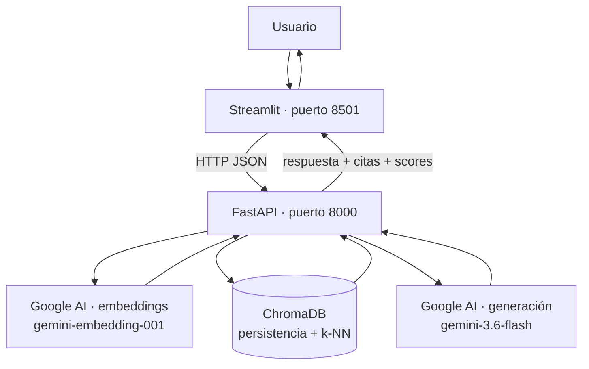

# RAG Bancario — Sistema de preguntas y respuestas sobre documentación bancaria

Sistema **RAG** (Retrieval-Augmented Generation / generación aumentada por
recuperación) que responde preguntas sobre un corpus de documentación bancaria
**anclando cada respuesta en la evidencia recuperada** y citando las fuentes.
Si la pregunta no tiene respuesta en el corpus, el sistema **se abstiene** en
lugar de inventar.

El ciclo completo es:

```
incrustar → indexar → recuperar top-k → generar respuesta anclada con citas
```

---

## Arquitectura

La interfaz **nunca** habla directamente con ChromaDB ni con Google AI: todo
pasa por la API de FastAPI. Streamlit es solo un cliente HTTP.



### Las cuatro piezas obligatorias

| Capa | Tecnología | Rol en el sistema |
|---|---|---|
| **UI** | Streamlit | Cargar documentos, preguntar y ver la respuesta con citas y scores |
| **API** | FastAPI | Ingestar, consultar e informar el estado del índice |
| **Índice** | ChromaDB | Guardar chunks + embeddings y devolver los más similares (persistente en disco) |
| **Embeddings + Generación** | Google AI (Gemini) | Convertir texto en vectores y redactar la respuesta anclada |

---

## Flujo de datos

El mismo modelo de embeddings se usa en los dos momentos (documentos y
preguntas); de lo contrario, la búsqueda de similitud no tendría sentido.

**Ingesta** (cuando se suben documentos):

```
archivo → chunk.py (trocea) → embed.py (cada chunk → vector) → store.py (guarda en Chroma)
```

**Consulta** (cuando el usuario pregunta):

```
pregunta → embed.py (pregunta → vector) → store.py (top-k más parecidos) → generate.py (Gemini redacta con citas) → respuesta
```

---

## Estructura de carpetas

```
rag-app/
├── README.md
├── requirements.txt
├── .env.example          # plantilla: GEMINI_API_KEY= (vacío, SÍ se sube)
├── .env                  # clave real (NO se sube, está en .gitignore)
├── .gitignore
├── data/                 # corpus (.md / .txt)
├── chroma/               # persistencia de ChromaDB (en .gitignore)
├── app/
│   ├── __init__.py       # marca app/ como paquete de Python
│   ├── main.py           # FastAPI: /health, /ingest, /query
│   ├── chunk.py          # partición del texto en chunks con solape
│   ├── embed.py          # cliente de embeddings de Google AI
│   ├── store.py          # ChromaDB: alta y consulta top-k
│   └── generate.py       # Gemini: respuesta anclada + abstención
└── ui/
    └── streamlit_app.py  # carga de documentos, pregunta, citas y scores
```

---

## Los módulos, uno por uno

### `chunk.py` — partición del texto
Divide un texto largo en fragmentos ("chunks") de tamaño configurable con
**solape** (overlap) entre fragmentos vecinos, para no cortar ideas a la mitad.
Recuperar el fragmento relevante es más preciso que recuperar el documento
entero.
- **Entrada:** un string largo. **Salida:** una lista de strings más cortos.
- **Parámetros:** `chunk_size` (300 palabras), `overlap` (60 palabras).

### `embed.py` — embeddings con Google AI
Convierte un texto (chunk o pregunta) en un vector numérico que representa su
significado. Textos con significado parecido producen vectores cercanos
(similitud del coseno). Es la única fuente de embeddings del sistema.
- **Entrada:** un string. **Salida:** `list[float]` (3072 dimensiones).
- **Modelo:** `gemini-embedding-001`.

### `store.py` — índice vectorial (ChromaDB)
Interfaz con ChromaDB. Guarda chunks + vectores + metadatos y, dada una
pregunta ya convertida en vector, encuentra los `top-k` chunks más cercanos.
Es **persistente en disco** (carpeta `chroma/`): reiniciar la API no borra el
índice. **No** se usa el embedder por defecto de Chroma; se le pasan los
vectores ya calculados por Google AI.
- **Operaciones:** `add_chunks(...)` y `query_chunks(...)`.
- **Metadatos por chunk:** `source` (archivo) y `chunk_index` (posición).

### `generate.py` — respuesta anclada (Gemini)
Toma la pregunta + los chunks recuperados y le pide a **Gemini** una respuesta
redactada **solo con esa evidencia**, en español, citando `[1]`, `[2]`, … Aquí
vive la regla de **abstención**. La llamada a Gemini está protegida con
`try/except` para que un fallo del modelo no tumbe la API.
- **Entrada:** pregunta + lista de chunks (texto, fuente, score).
- **Salida:** dict con `answer`, `abstained` y, si hubo fallo, `error`.
- **Modelo:** `gemini-3.6-flash`. Umbral de abstención: `MIN_SCORE = 0.3`.

### `main.py` — la API (FastAPI)
Orquesta todo lo anterior y lo expone como API HTTP. Es el único punto de
entrada que consume Streamlit.

### `streamlit_app.py` — la interfaz (Streamlit)
Interfaz donde el usuario sube documentos (llama a `/ingest`) y hace preguntas
(llama a `/query`), mostrando la respuesta, las citas y los chunks usados
(origen + score). Nunca ejecuta lógica de RAG por su cuenta.

---

## Endpoints de la API

| Método | Ruta | Descripción |
|---|---|---|
| `GET` | `/health` | Confirma que la API vive |
| `POST` | `/ingest` | Recibe `text` y `source`, chunkifica, incrusta y persiste en Chroma. Devuelve nº de chunks indexados |
| `POST` | `/query` | Recibe `question` (y opcional `top_k`). Devuelve `answer`, `citations` (id, source, text, score), `abstained` y `error` |

Documentación interactiva en `http://localhost:8000/docs` (Swagger).

### Estados de la respuesta de `/query`

| Estado | `abstained` | `error` | Significado |
|---|---|---|---|
| **Respondió** | `false` | `null` | Hubo evidencia y Gemini redactó la respuesta |
| **Se abstuvo** | `true` | `null` | Ningún chunk superó el umbral de similitud |
| **Error** | `false` | mensaje | El corpus tenía evidencia, pero el modelo falló (ej. 503) |

---

## Instalación y ejecución

### 1. Requisitos previos
- Python 3.10+
- Una clave de API de Google AI Studio: https://aistudio.google.com/apikey

### 2. Crear el entorno e instalar dependencias
```bash
cd rag-app
python -m venv venv
source venv/bin/activate          # Windows: venv\Scripts\Activate.ps1
pip install -r requirements.txt
```

### 3. Configurar la clave
Copia `.env.example` a un archivo nuevo `.env` y pon tu clave real:
```
GEMINI_API_KEY=tu_clave_aqui
```
> `.env` está en `.gitignore` y **no** se sube. `.env.example` es la plantilla.

### 4. Levantar la API y la UI (dos terminales)
```bash
# Terminal 1 — API
uvicorn app.main:app --reload --port 8000

# Terminal 2 — UI
streamlit run ui/streamlit_app.py
```

Abre Streamlit (normalmente `http://localhost:8501`), carga los documentos
desde la barra lateral y haz tu primera pregunta.

---

## Corpus

- **Dominio:** documentación operativa de un sistema bancario (gestión de
  incidentes, Command Center, escalaciones y guardias, procedimientos, más
  información institucional). [COMPLETAR/AJUSTAR según tu corpus final]
- **Tamaño:** [COMPLETAR: N documentos, ~X palabras en total].
- **Formatos:** `.txt` y `.md`.
- Incluye al menos **una pregunta fuera de dominio** para probar la abstención
  (ej.: [COMPLETAR: tu pregunta imposible]).

---

## Regla de abstención

El sistema se abstiene cuando la evidencia recuperada no cubre la pregunta.
Criterio (dos capas):

1. **Umbral sobre el mejor chunk (`MIN_SCORE = 0.3`):** si ni el chunk más
   parecido supera el umbral, el sistema se abstiene **sin llamar a Gemini**.
   Si el mejor pasa, se incluyen todos los `top-k` chunks en el contexto.
2. **Instrucción al modelo:** el prompt le indica a Gemini que, si el contexto
   no contiene la respuesta, diga explícitamente que no hay evidencia
   suficiente en lugar de inventar.

> Nota: ChromaDB devuelve **distancias** (menor = más parecido). El `score`
> mostrado en la UI se deriva como `score = 1 - distancia`.

---

## Estado del proyecto

- [x] Estructura de carpetas + entorno virtual + `requirements.txt`
- [x] `.env.example` y `.gitignore`
- [x] `main.py` con `GET /health` (verificado en `/docs`)
- [x] `chunk.py` (validado con corpus real)
- [x] `embed.py` (validado: coseno frases parecidas > ajena)
- [x] `store.py` (validado: recuperación correcta + persistencia con `count()`)
- [x] `POST /ingest` (chunk → embed → store)
- [x] `POST /query` (recuperación + citas + scores)
- [x] `generate.py` (Gemini + abstención + manejo de errores)
- [x] Integración de `generate.py` en `/query` (3 estados: respuesta/abstención/error)
- [x] `streamlit_app.py` (carga + pregunta + citas + scores)
- [ ] Corpus completo (≥ 5 documentos en `data/`) — [CONFIRMAR]
- [ ] Pruebas finales (3 preguntas del dominio + 1 fuera de dominio)
- [ ] Evidencias (capturas) y reporte de una página
